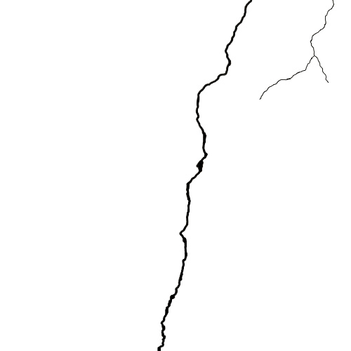

#### 数据集简介

依托photo shop软件全人工标注的混凝土裂隙数据集CSU-Crack。涵盖了常见混凝土特定应用场景图像，包括隧道内壁裂隙、路面裂隙、地上建筑表面裂隙，为裂隙图像识别算法的研究及后续裂隙参数数字表征提供研究数据。

#### 数据集人工标注说明
* 人工标注制作标准：
   *  裂隙原图像的导入与主体裁剪；
为降低训练所需的计算机显存及加快模型像素匹配误差的收敛速度，所采集的图像裂隙主体裁剪为统一尺寸：500Pixel×500Pixel。
   *  对裁剪后裂隙主体图像进行全人工图像标注。
机器学习中图像识别的训练是根据像素点进行的，因此，图像标注的质量好坏取决于像素点的判定准确性。如果标注像素点越接近标注物的边缘像素，则标注质量越高，标注难度就越大；反之，则标注量较差，标注难度较小。按照100%准确率的图像标注要求，标注像素点与标注物的边缘像素点的误差应该控制在1 个像素以内。
* 对于裂隙图像的标注采用Photoshop 软件，其具体步骤如下：
   *  首先是图层的添加，这样可以保持我们图像的独立性不会影响操作。其次进行裂隙的标注，“画笔”选择“硬边圆”，这样标注的裂隙周围不会有阴影。同时，预调不透明度为100%，流量100%，平滑0%，颜色RGB 值为#000000，最后，用白色“油漆桶”将图层中的非裂隙部分进行填充。
   *  每一张原始图像需要对应一张标签图，标签图组成目标数据集。标签图是将图像中的裂隙和非裂隙像素标注为特定颜色的参考基准，为提高后期训练准确率，对数据集原始图像进行了人工裂隙标注，再经二值化转换为标签图。在标签中，通过不同的颜色区分图像中的不同类别，裂隙部分标注为R-G-B：0-0-0 的黑色区域，非裂隙部分标注为R-G-B：255-255-255的白色区域。（样例如下）

#### 数据集样例

原图

标签

#### 数据集原图命名规则

* 原图： “xxxx.jpg"
* 人工标注图片：”xxxx_label.jpg"

#### 欢迎各位朋友使用和完善该数据集
